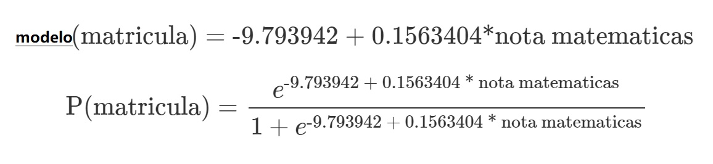

### Objetivo
* Determinar un modelo de regresión logística que permita realizar prediccionas para encontar la probabilidad de que un alumno aparezca en el cuadro de honor con la calificación de matemática registrada

### Descripción 
* Se genera una función sigmoide y se usa para entender la probabilidad de que una alumno obtenga una calificación de matemáticas tal que permita predecir la probabilidad de que aparezca en el cuadro e honor a matricula igual a 1
* Se visualiza un diagrama de caja en relación a la calificación de matemáticas y los que NO aparecen y SI aparecen en el cuadro de honor en la columna matricula
* Se identifica los coeficientes del modelo y se interptetan resultados

#### Las librerías
```{r warning=FALSE, message=FALSE}
library(ggplot2)
library(vcd)
library(knitr) # Para ver tablas mas amigables en formato html markdown

```

#### Los datos
* Se generan datos, en el vector matricula se determinan valores 0 si NO aparece en cuadro de honor y 1 si SI aparece
* Se generan calificaciones de una asignatura de matemáticas
* Se integra un conjunto de datos en un data.frame llamado datos
* Se visualizan los primeros y últimos 10 registros de datos
* Se determina el valor de n la cantidad de observaciones de los datos
```{r}
matricula <- as.factor(c(0, 0, 0, 0, 0, 0, 0, 0, 0, 0, 0, 1, 0, 1, 0, 0, 0, 0, 1,0, 0, 1, 0, 0, 0, 0, 1, 0, 0, 0, 0, 0, 1, 0, 0, 1, 0, 1,0, 0, 0, 0, 0, 0, 1, 0, 0, 0, 0, 0, 1, 0, 0, 0, 1, 0, 0, 0, 0, 0, 0, 1, 0, 0, 0, 0, 0, 0, 0, 0, 0, 0, 1, 0, 0, 0, 1, 0, 0, 0, 0, 0, 0, 1, 0, 1, 0, 0, 0, 0, 1, 0, 1, 0, 0, 1, 1, 1, 0, 1, 0, 0, 0, 0, 0, 0, 1, 0, 0, 1, 0, 0, 0, 1, 1, 0, 0, 1, 0, 0, 0, 0, 0, 0, 1, 0, 0, 0, 0, 0, 0, 1, 1, 0, 0, 1, 0, 0, 0, 0, 0, 0, 0, 0, 0, 0, 1, 0, 0, 0, 0, 0, 0, 0, 1, 0, 0, 0, 0, 1, 1, 0, 1, 1, 0, 0, 0, 0, 1, 0, 0, 0, 0, 0, 0, 0, 1, 0, 0, 1, 1, 0, 1, 1, 1, 1, 0, 0, 1, 0, 0, 0, 0, 0, 1, 0, 0, 0, 1, 1))

matematicas <- c(41, 53, 54, 47, 57, 51, 42, 45, 54, 52, 51, 51, 71, 57, 50, 43, 51, 60, 62, 57, 35, 75, 45, 57, 45, 46, 66, 57, 49, 49, 57, 64, 63, 57, 50, 58, 75, 68, 44, 40, 41, 62, 57, 43, 48, 63, 39, 70,
63, 59, 61, 38, 61, 49, 73, 44, 42, 39, 55, 52, 45, 61, 39, 41,
50, 40, 60, 47, 59, 49, 46, 58, 71, 58, 46, 43, 54, 56, 46, 54,
57, 54, 71, 48, 40, 64, 51, 39, 40, 61, 66, 49, 65, 52, 46, 61,
72, 71, 40, 69, 64, 56, 49, 54, 53, 66, 67, 40, 46, 69, 40, 41,
57, 58, 57, 37, 55, 62, 64, 40, 50, 46, 53, 52, 45, 56, 45, 54,
56, 41, 54, 72, 56, 47, 49, 60, 54, 55, 33, 49, 43, 50, 52, 48,
58, 43, 41, 43, 46, 44, 43, 61, 40, 49, 56, 61, 50, 51, 42, 67,
53, 50, 51, 72, 48, 40, 53, 39, 63, 51, 45, 39, 42, 62, 44, 65,
63, 54, 45, 60, 49, 48, 57, 55, 66, 64, 55, 42, 56, 53, 41, 42,
53, 42, 60, 52, 38, 57, 58, 65)

datos <- data.frame(matricula, matematicas)
head(datos, 10)
tail(datos,10)
n <- nrow(datos) # Total de casos
n
```

#### Tabla de Frecuencias
* Hay 151 casos de que NO aparecen en el cuadro de honor
* Exiten 49 casos de SI aparecen en cuadro de honor
# Tabla de casos de Honor y No Honor. 
* matricula = 0 o 
* matricula = 1

```{r}
table(datos$matricula)
```

#### Graficando los datos
* Crear boxplot de la relación que existe entre calificación de matemáticas y los que NO aparecen (matricula = 0) y SI aparecen (matricula = 1) en el cuadro de honor
* ¿ Qué significa la gráfica?
* A mayor calificación de matemáticas es mas probable que aparezca en cuadro de honor o matricula = 1
```{r}
ggplot(data = datos, aes(x = matricula, y = matematicas, color = matricula)) +
  geom_boxplot(outlier.shape = NA) +
  geom_jitter(width = 0.1) +
  theme_bw() +
  theme(legend.position = "null")

```


### Generar el modelo de regresión logística
* La fórmula que utiliza el modelo de regresión logística es matricula en función de la calificación de matemáticas
* El coeficiente estimado para la intersección es el valor esperado del logaritmo de que un estudiante obtenga matrícula teniendo una cierta calificación de matemáticas.
* exp(−9.793942) = 5.579e−5 
* lo que corresponde con una probabilidad de obtener matrícula de 5.579e−5 cuando la calificación de matemáticas es 0
* Sin embargo para cada valor de calificación de matemática la el valor de la probabiidad de predicción aumenta
Probabilidad:  
```{r}
# Generar el modelo de regresión logística
modelo <- glm(matricula ~ matematicas, data = datos, family = "binomial")
summary(modelo)
```


#### Gráfica de la función sigmoide de matrícula con relación a matemáticas
* Codificación 0,1 es la variable respuesta
```{r}

datos$matricula <- as.character(datos$matricula)
datos$matricula <- as.numeric(datos$matricula)

plot(matricula ~ matematicas, datos, col = "darkblue",
     main = "Modelo regresión logística",
     ylab = "P(matrícula=1|matemáticas)",
     xlab = "matemáticas", pch = "I")

# type = "response" devuelve las predicciones en forma de probabilidad en lugar de en log_ODDs
curve(predict(modelo, data.frame(matematicas = x), type = "response"),
      col = "firebrick", lwd = 2.5, add = TRUE)

```

#### Codificar a valores 0 y 1 los valores ajustados del modelo 'modelo$fitted.values'

* Por decisión del analista, se recodifican las probabilidades con una variable en R llamada predicciones_modelo, poniendo 0 cuando la probabilidad es menor o igual a 0.5 y 1 cuando la probabilidad es mayor a 0.5
* Se agrega una nueva columna a los datos originales que sería la predicción conforme al modelo
```{r}
predicciones_modelo <- ifelse(modelo$fitted.values > 0.5, 1, 0)
datos$predicciones <- (as.vector(predicciones_modelo))

```


#### Mostrando el conjunto de datos
* Columna 1 es la matricula
* Columna 2 es la calificación de matemáticas
* Columna 3 es la predicción hecha por el modelo
```{r}
kable(datos)
```

### Evaluar el modelo
* ¿Que tan exacto es el modelo para predecir?
* La exactitud es la cantidad de predicciones positivas que son correctas, en este caso se determina la exatitud con los valores ajustados del modelo

#### Generando una matriz de confusión
* Se crea la matriz de confusión
* Con el vector datos$matricula original 0 o 1 
* y con el vector ajustados del modelo 0 o 1
* De los 200 datos originales, de la matriz de confusión interesa por lo pronto lo siguiente: 
* ¿Cuántos valores en matrícula son 0 originalmente y cuántos fueron ajustados con valor 0 correctamente? Falsos Positivos
* ¿Cuántos valores en matrícula son 1 originalmente y cuántos fueron ajustados con valor 1 correctamente? Verdaderos Positivos
* De los 200 datos, hay 151 casos con valores igual a 0 en matrícula, con el modelo de regresión logística se obtuvieron 140 casos ajustados y acertados correctamente y se falló en 11.
* De los 200 datos, había 149 casos con valores igual a 1 en matrícula, con el modelo de regresión logística se obtuvieron 22 casos ajustados y acertados correctamente y se falló en 22.
* ¿Qué significa?
```{r}

matriz_confusion <- table(datos$matricula, datos$predicciones, dnn = c("matrícula original", "predicciones"))
matriz_confusion

```


#### Interpretación de la matriz de confusión
* La exactitud
* El modelo es capaz de clasificar y predecir correctamente (140 + 22) / 200 = 0.81(81%) de las observaciones.

```{r}
cat ("Total de casos ", n)
cat ("Total de aciertos =  ", (matriz_confusion[1,1] + matriz_confusion[2,2]) / n)
```

### Predicciones con el modelo de regresión logístia

#### Predicciones usando la fórmula

Probabilidad:  

* ¿Cual es la prediccion de un alumno para cuando tiene valor de matemáticas 33?
* ¿Cual es la prediccion de un alumno para cuando tiene valor de matemáticas 50?
* ¿Cual es la prediccion de un alumno para cuando tiene valor de matemáticas 60?
* ¿Cual es la prediccion de un alumno para cuando tiene valor de matemáticas 70?
* Verificar las predicciones para las calificaciones de 33, 50, 60 y 70 cuando se generan por la función predict()
```{r}
nuevos_valores <- c(33, 50, 60, 70)
prediccion_manual <- exp (−9.793942 + 0.15634 * nuevos_valores) / (1 + exp (−9.793942 + 0.15634 * nuevos_valores))
prediccion_manual
```


#### Nuevos valores a predecir
* Los nuevos puntos son nuevas calificaciones a partir de 33 y con incrementos de 0.5 hasta llegar a 75
* los nuevos puntos pudiera entenderse como datos de validación o prueba para ser aplicados en el modelo y generar la predicción 
```{r}
nuevos_puntos <- seq(from = min(datos$matematicas), to = max(datos$matematicas),by = 0.5)

nuevos_puntos
```

#### Predicciones de los nuevos puntos
* Como si fuera un conjunto de datos de validación
```{r}
predicciones <- predict(modelo, data.frame(matematicas = nuevos_puntos), se.fit = TRUE)
predicciones
```

#### Convertido a probabilidades las predicciones
```{r}
predicciones_prob <- exp(predicciones$fit) / (1 + exp(predicciones$fit))
predicciones_prob
```

#### Crear un conjunto de datos con las predicciones de los nuevos valores 
* Valor de matemáticas a predecir son los nuevos_puntos
* Su prediccion es el valor probabilístico conforme al valor de matemáticas
* Verificar la probabilidad de la predicción para los valores de matemáticas = 33, 50 60 y 70 que se obtuvieron conforme a la fórmula de predicción y probabilidad en el paso anterior
```{r}
las.predicciones <- data.frame(nuevos_puntos, predicciones_prob)
colnames(las.predicciones) <- c('matematicas', 'prob.prediccion.matricula')
las.predicciones
                
```

#### Gráfica de calificaciones a partir de 33 hasta 75
* Se parece a la gráfica de la función Sigmoide S
* A partir de una calificación de 63 en matemáticas, se predice con una probabilidad mayor al 50%
```{r}
plot(las.predicciones)
```


### interpretación personal
* Pendiente se espera comentarios de alumnos
* Pendiente se espera comentarios de alumnos